## Vacancy Parser — отчёт по управлению производительностью

### 1. Описание проекта

**Vacancy Parser** — учебное Spring Boot‑приложение для многопоточного парсинга вакансий с сайтов **HH.ru**, **Habr Career** и **SuperJob** и сохранения результатов в in‑memory базе **H2**.

- **Многопоточность**: `CompletableFuture` + кастомный `ThreadPoolTaskExecutor`.
- **Хранение данных**: H2 Database (`jdbc:h2:mem:vacanciesdb`).
- **Планировщик**: `@Scheduled` периодически обновляет вакансии.
- **Веб‑слой**: Spring MVC + Thymeleaf (страница `index.html`).
- **Наблюдаемость и производительность** (в рамках этого задания):
  - Spring Boot Actuator + Micrometer + Prometheus.
  - JMH‑бенчмарки.
  - Профилирование (VisualVM / JFR).
  - Анализ GC.
  - OpenTelemetry + Jaeger (через OTLP).

### 2. Требования и окружение

- **Java**: 17+
- **Maven**: 3.8+  
- **СУБД**: H2 (встроенная, без отдельной установки)
- Примечание: использовалась местами postgresql
- **Порт приложения**: `8080`

#### Установка и запуск

- **Сборка проекта**

```bash
mvn clean package
```

- **Запуск Spring Boot приложения**

```bash
mvn spring-boot:run
```

После запуска:
- веб‑интерфейс: `http://localhost:8080/`
- метрики Prometheus: `http://localhost:8080/actuator/prometheus`
- Actuator‑эндпоинты: `http://localhost:8080/actuator/...`

---

## Шаг 1. Сбор метрик с помощью Micrometer и Prometheus

### 1.1. Подключённые зависимости и конфигурация

- В `pom.xml` добавлены:
  - `spring-boot-starter-actuator`
  - `io.micrometer:micrometer-registry-prometheus`

- В `application.properties` включены нужные эндпоинты и гистограммы HTTP запросов (`/actuator/metrics`, `/actuator/threaddump`, `/actuator/prometheus` и др.).

- Файл `prometheus.yml` на стороне Prometheus настроен на таргет:
  - `localhost:8080`
  - `metrics_path: /actuator/prometheus`

### 1.2. Кастомные метрики Micrometer

В сервисе `VacancyService` реализованы следующие метрики:

- **Timer**:
  - `vacancy_parser.parsing.duration` — время полного цикла «парсинг + сохранение в БД» (с percentiles p50/p95/p99).
- **Counters**:
  - `vacancy_parser.parsing.success.count` — количество успешных запусков парсинга.
  - `vacancy_parser.parsing.error.count` — количество неуспешных (с ошибкой) запусков парсинга.
  - `vacancy_parser.db.saved.records.count` — общее количество записей, сохранённых в БД.

Метрики инкрементируются/регистрируются при каждом вызове метода `fetchAndSaveVacancies()`.

### 1.3. Скриншоты

Пример визуализации метрик в Grafana (RPS, задержка и потоки):

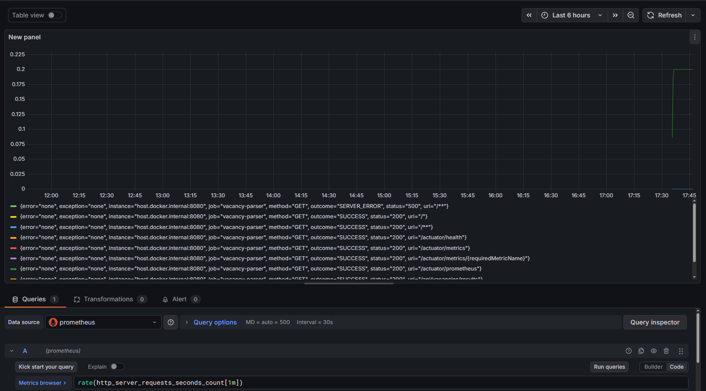

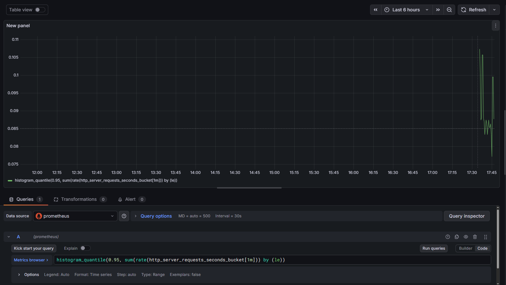

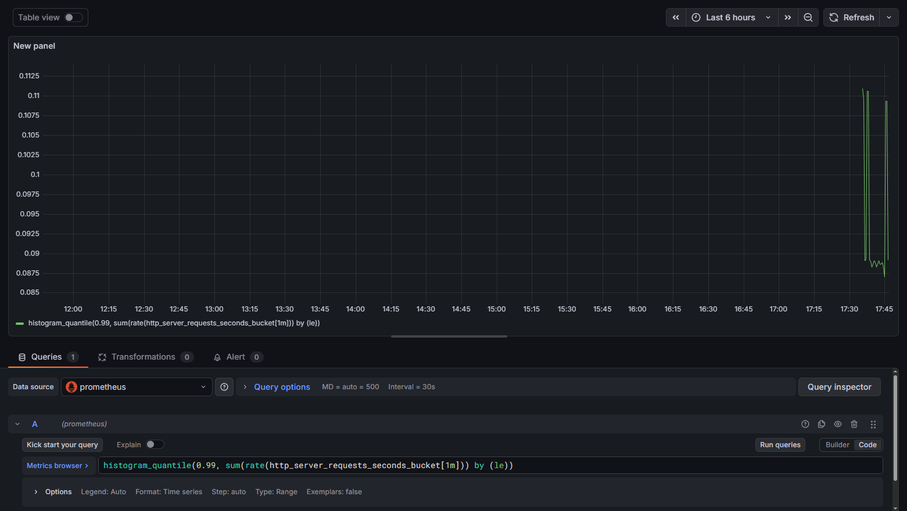

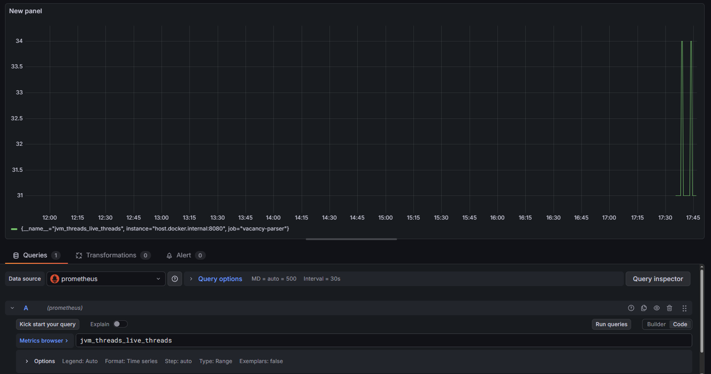

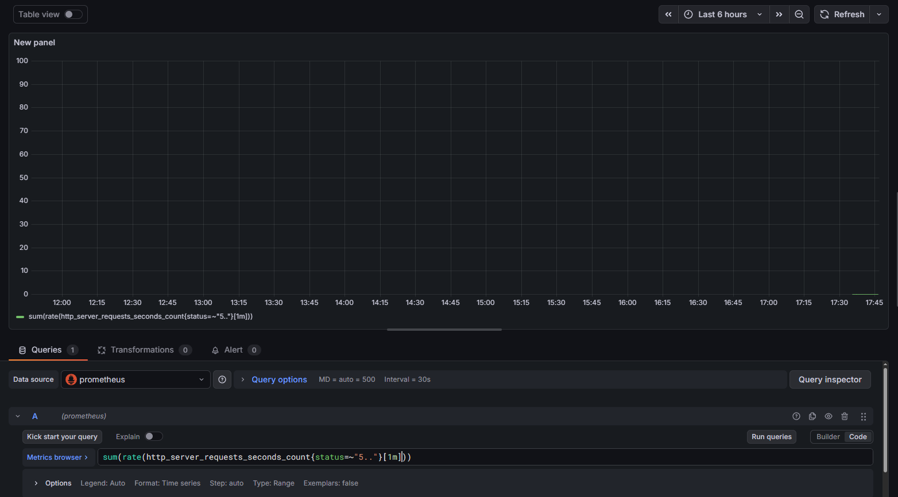

---

## Шаг 2. Профилирование и диагностика (VisualVM / JFR + JMH)

### 2.1. Настройка VisualVM / JFR

Для профилирования приложение запускается с подключением профайлера:

- **Вариант с JFR**:
  - JVM‑аргументы, например:  
    `-XX:StartFlightRecording=filename=recording.jfr,dumponexit=true`
- **Вариант с VisualVM**:
  - запустить `mvn spring-boot:run`,
  - подключиться к процессу Java через VisualVM.

### 2.2. Что анализируется

- **CPU и медленные методы**:
  - `VacancyService.fetchAndSaveVacancies`
  - `AsyncParserService.parseAllSources`
  - парсеры: `HhParser`, `HabrParser`, `SuperJobParser`
- **GC**:
  - частота сборок,
  - длительность пауз,
  - объём перерабатываемой памяти.
- **Threads**:
  - активные потоки `Parser-*` из кастомного пула,
  - состояние потоков, наличие блокировок.
- **Heap**:
  - сколько памяти занимают коллекции с вакансиями (`List<VacancyDTO>`, `List<Vacancy>`),
  - строки JSON/HTML, временные буферы.

### 2.3. JMH‑бенчмаркинг разных реализаций

Создан JMH‑класс `ParsingBenchmark` (`src/test/java/.../benchmark/ParsingBenchmark.java`), который сравнивает:

- `mapWithForLoop` — классический `for`‑цикл;
- `mapWithStream` — преобразование через `stream().map(...).collect(...)`;
- `mapWithParallelStream` — `parallelStream()` для многопоточной обработки.

Используются аннотации:

- `@Benchmark`
- `@Warmup`
- `@Measurement`
- `@Fork`
- `@BenchmarkMode(Mode.Throughput)`

**Запуск JMH (через `exec-maven-plugin` и `JmhRunner`):**

```bash
mvn -DskipTests=true exec:java
```

В конце вывода Maven появится стандартная таблица JMH с результатами для `mapWithForLoop`, `mapWithStream` и `mapWithParallelStream` при размерах 100 и 1000 элементов.

### 2.4. Результаты JMH и краткий анализ

Иллюстрации профилирования:

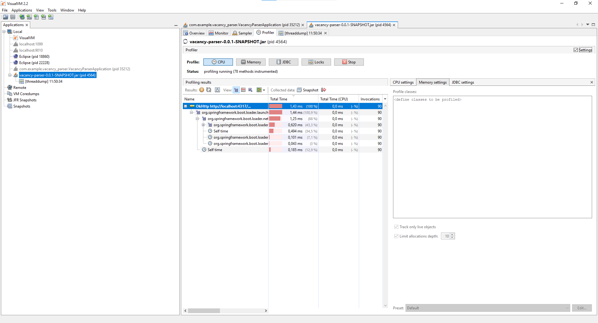

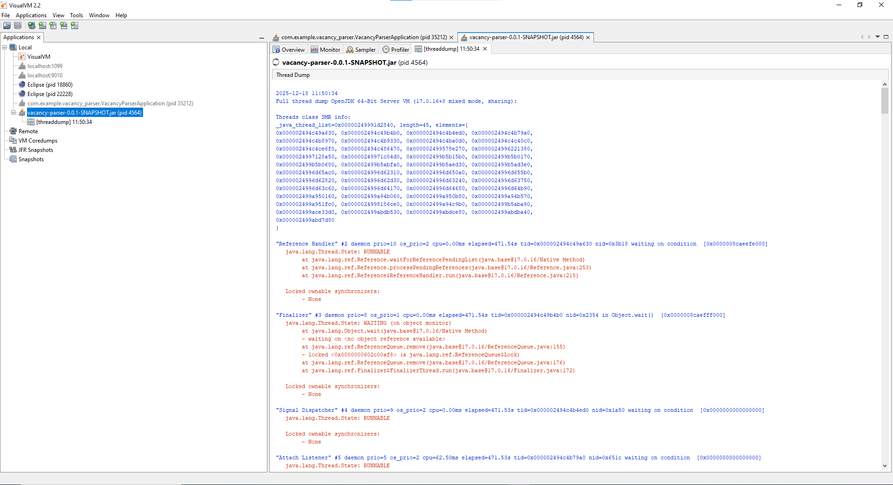

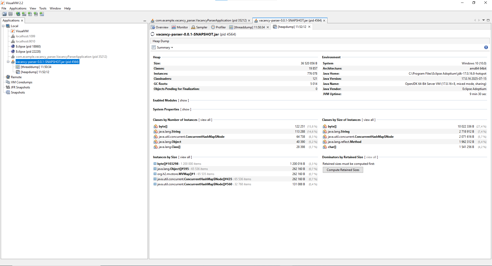

---
- **Примечание по VisualVM**: при попытке использовать VisualVM 2.2 под JDK 17 для CPU‑профилирования возникли ошибки  
  `CPU sampling: Not available. Failed to create JMX connection to target application` (Sampler → CPU)  
  и `Redefinition failed with error 62` (Profiler → CPU).  
  Поэтому для анализа CPU и GC дополнительно использовался Java Flight Recorder (JFR) / Java Mission Control, а в VisualVM были сняты Heap Dump, Thread Dump и Memory Sampler.

Фактические результаты JMH (Throughput, операций в секунду):

| Benchmark                               | size | Mode  | Cnt | Score (ops/s)      | Error       |
|----------------------------------------|------|-------|-----|--------------------|------------|
| `ParsingBenchmark.mapWithForLoop`      | 100  | thrpt | 5   | 1 708 441,816      | 121 978,908 |
| `ParsingBenchmark.mapWithForLoop`      | 1000 | thrpt | 5   |   164 995,040      |   9 455,651 |
| `ParsingBenchmark.mapWithParallelStream` | 100 | thrpt | 5 |    50 242,747      |   1 961,591 |
| `ParsingBenchmark.mapWithParallelStream` | 1000 | thrpt | 5 |    36 728,311      |   1 787,942 |
| `ParsingBenchmark.mapWithStream`       | 100  | thrpt | 5   |   887 819,721      | 374 015,301 |
| `ParsingBenchmark.mapWithStream`       | 1000 | thrpt | 5   |    92 029,781      |  35 203,813 |

Выводы:

- классический `for`‑цикл даёт наилучший Throughput и при `size=100`, и при `size=1000` (примерно в 2 раза быстрее `stream()` и в 3–4 раза быстрее `parallelStream()`);
- обычный `stream()` заметно медленнее `for`, но остаётся приемлемым вариантом с более декларативным стилем кода;
- `parallelStream()` в этом сценарии проигрывает обоим за счёт накладных расходов на параллелизм и оказывается неоптимальным для коллекций умеренного размера.

**Примечание по VisualVM**: при попытке использовать VisualVM 2.2 под JDK 17 для CPU‑профилирования возникли ошибки  
`CPU sampling: Not available. Failed to create JMX connection to target application` (Sampler → CPU)  
и `Redefinition failed with error 62` (Profiler → CPU).  
Поэтому для анализа CPU и GC дополнительно использовался Java Flight Recorder (JFR) / Java Mission Control, а в VisualVM были сняты Heap Dump, Thread Dump и Memory Sampler.

## Шаг 3. Анализ управления памятью и GC

### 3.1. Влияние парсинга на память и GC

Парсинг создаёт:
- временные строки (JSON, HTML),
- DTO‑объекты (`VacancyDTO`),
- сущности (`Vacancy`),
- коллекции `List<VacancyDTO>` и `List<Vacancy>`.

Эти объекты попадают в young‑generation и частично в old‑generation, что инициирует GC.

### 3.2. Что оценивать в отчёте

- Частота срабатывания GC и суммарное время пауз (по GC‑логам или профайлеру).
- Размер коллекций с вакансиями при типичной нагрузке.
- Наличие «тяжёлых» объектов (большие списки/строки).

### 3.3. Сделанные оптимизации, влияющие на GC

- **Повторное использование `ObjectMapper` в `HhParser`**:
  - вместо создания нового объекта при каждом запросе — один экземпляр как поле класса.

### 3.4. Скриншоты

Примеры анализа памяти и GC в VisualVM:

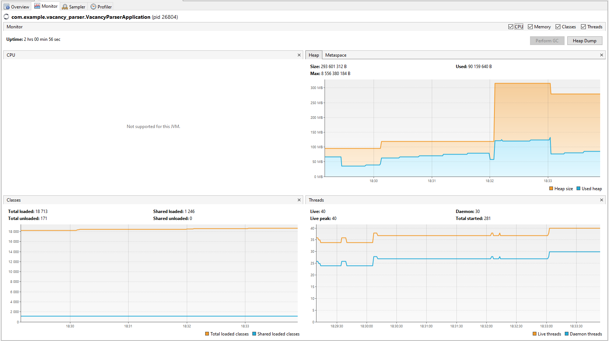

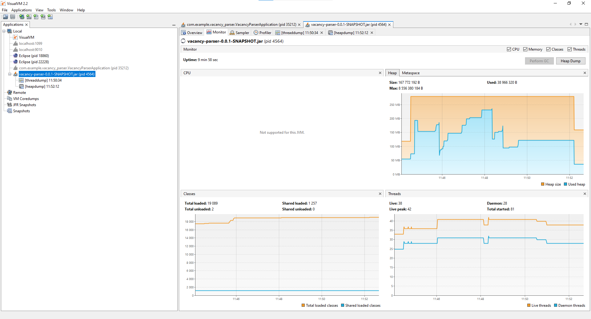

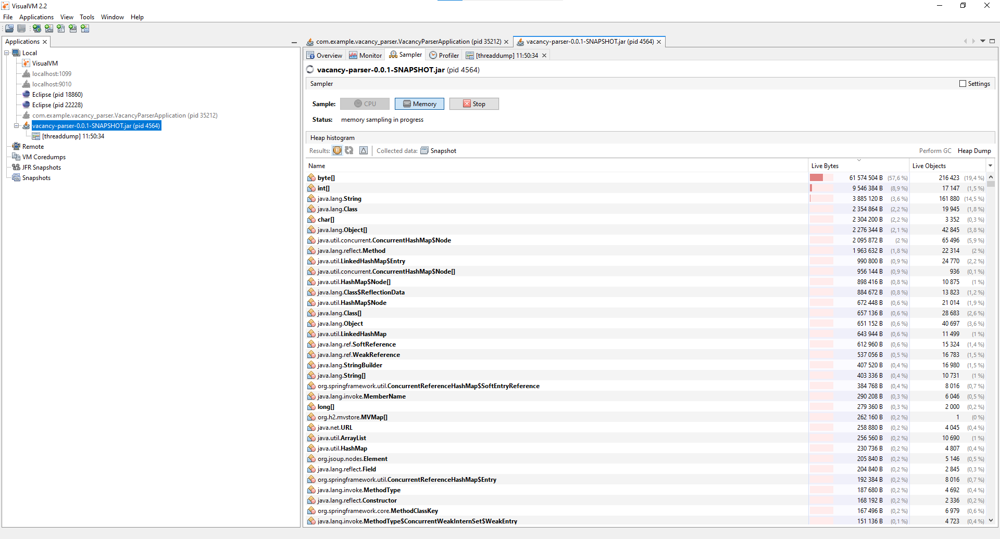

---
- **Краткий вывод**: какие объекты доминируют по памяти, есть ли GC‑pressure и как оптимизации помогают его снижать.

## Шаг 4. Поиск и исправление деградации производительности

### 4.1. Найденные проблемы

- **Лишний уровень асинхронности**:
  - одновременно использовались `@Async` и `CompletableFuture.supplyAsync(...)`, что приводило к лишним переключениям контекста.
- **Избыточный `parallelStream`** для небольших наборов данных:
  - в `DataAggregatorService` использовались `parallelStream()` для фильтрации/сортировки, что давало лишний overhead.
- **Частые аллокации `ObjectMapper` в `HhParser`**:
  - `ObjectMapper` создавался внутри метода парсинга каждый раз.

### 4.2. Внесённые исправления

- **Async/CompletableFuture**:
  - убран `@Async` с метода `parseAllSources()`, оставлены только `CompletableFuture.supplyAsync(..., executor)` в `AsyncParserService`.
  - итог: более предсказуемое использование одного пула потоков без двойной перекидки задач.

- **Stream vs parallelStream**:
  - `parallelStream()` в `DataAggregatorService` заменён на обычный `stream()`:
    - сортировка и фильтрация работают без лишних потоков и синхронизации.

- **ObjectMapper reuse**:
  - в `HhParser` `ObjectMapper` вынесен в поле класса и переиспользуется.

### 4.3. Дополнительно про БД

- Используется in‑memory H2 с простыми операциями:
  - `deleteAll()` + `saveAll()` без сложных выборок.
- N+1‑запросы в текущей архитектуре отсутствуют (используется один репозиторий с массовой загрузкой/сохранением).
- Индексы в in‑memory H2 для данного учебного проекта не критичны.

## Шаг 5. Настройка OpenTelemetry и Jaeger (трейсинг)

### 5.1. Подключённые зависимости и конфигурация

- В `pom.xml` добавлены:
  - `io.opentelemetry:opentelemetry-api`
  - `io.opentelemetry:opentelemetry-sdk`
  - `io.opentelemetry:opentelemetry-exporter-otlp`

- Класс `OpenTelemetryConfig` настраивает:
  - `OtlpGrpcSpanExporter` с endpoint `http://localhost:4317`
  - `SdkTracerProvider` + `BatchSpanProcessor`
  - бины `OpenTelemetry` и `Tracer`.

Предполагается, что **Jaeger** или другой OTLP‑коллектор запущен и слушает `4317`, а UI Jaeger доступен в браузере.

### 5.2. Спаны вокруг этапов парсинга и записи в БД

- В `VacancyService.fetchAndSaveVacancies()`:
  - создаётся корневой span `vacancy.fetchAndSave`;
  - добавляется атрибут `vacancies.saved` с количеством сохранённых вакансий;
  - при ошибке:
    - `span.recordException(ex)`,
    - `span.setStatus(ERROR)`.

- В `AsyncParserService.parseAllSources()`:
  - span `parser.parseAllSources` (общий этап парсинга из всех источников);
  - дочерние спаны `parser.parse.hh`, `parser.parse.habr`, `parser.parse.superjob` внутри метода `safeParse`;
  - в дочерних спанах атрибут `vacancies.count` — количество вакансий, полученных из конкретного источника.

### 5.3. Jaeger
Примеры реальных трейсов из Jaeger:

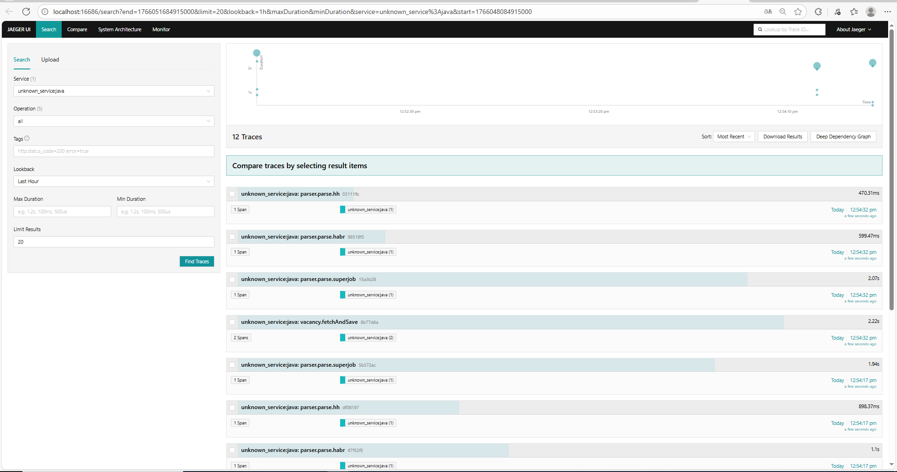

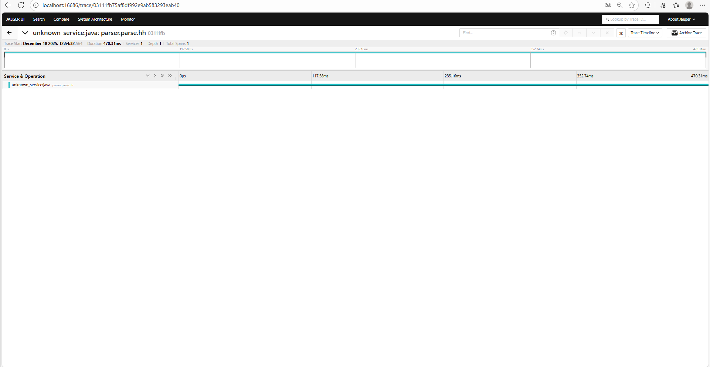

---
